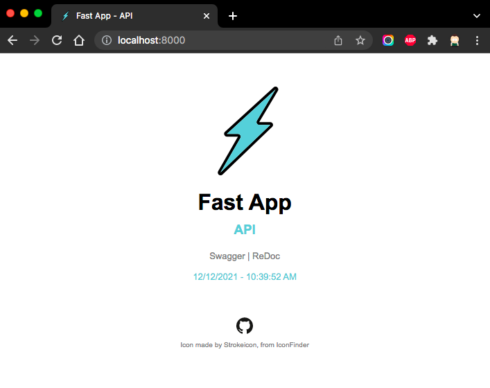

# Fast App - API


## Quick Start

Create your Python virtual environment...

```bash
# 👇 Setting PyEnv version
pyenv local 3.10.0

# 👇 Virtual Environment
python -m venv .venv \
  && source .venv/bin/activate \
  && python -m pip install --upgrade pip

# 👇 Dependencies
make install
```

Then, create a Dynaconf secrets file as follows.

```bash
echo "
[default]
TOKEN_SECRET_KEY = '$(openssl rand -hex 32)'
SECRET = '🚀'  # Dev Secret

[prod]
SECRET = '🤫'
" > .secrets.toml
```

Finally, start the API server.

> `APP_ENV` is an environment variable used by Dynaconf to indicate which profile should be used.

```bash
APP_ENV=dev uvicorn main:app --reload
```

After executing the previous command you are ready to access the API resources.

- API Home: `http://127.0.0.1:8000`
- Swagger: `http://127.0.0.1:8000/docs`
- ReDoc: `http://127.0.0.1:8000/redoc`



### Example

Response **OK**...

```bash
curl -X 'GET' 'http://127.0.0.1:8000/emoji'
```

```json
{
  "lucky_emojis": [
    "🫐",
    "🥭"
  ],
  "secret": "🚀",
  "consulted_at": "2021-10-22T11:36:48.533441"
}
```

### References

- [Fast API: docs](https://fastapi.tiangolo.com/)
- [pydantic: docs](https://pydantic-docs.helpmanual.io/)
- [Poetry CLI: docs](https://python-poetry.org/docs/cli/)
- [pre-commit: docs](https://pre-commit.com/)
- [MongoDB: Quick Start FastAPI](https://www.mongodb.com/developer/quickstart/python-quickstart-fastapi/)
- [Icon made by Strokeicon from IconFinder](https://www.iconfinder.com/icons/2191531/best_fast_flash_good_light_speed_icon)

> 💡 Fast API has an awesome documentation!
